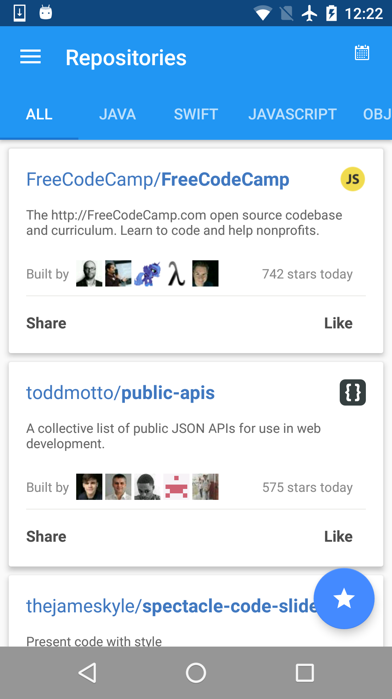
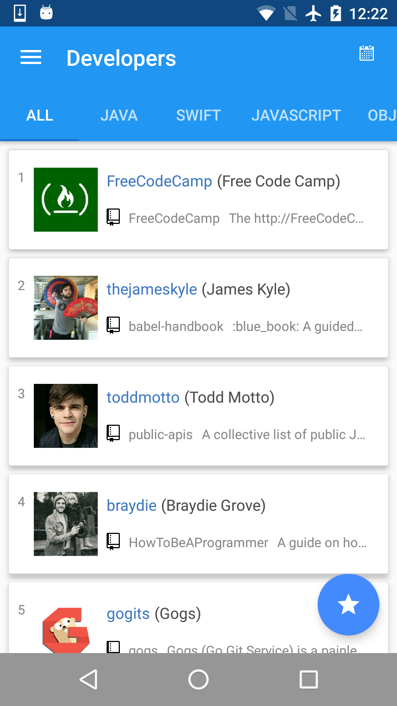
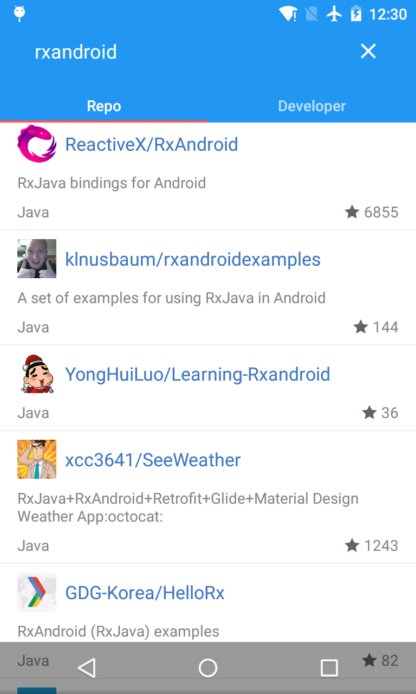

# Trending
##### *View the most trending repositories and developers in Github.*

  
 

##Screenshots
 

 
 

-------

# Third-party libraries used

+ [Retrofit](https://github.com/square/retrofit)

+ [RxJava](https://github.com/ReactiveX/RxJava)

+ [RxAndroid](https://github.com/ReactiveX/RxAndroid)

+ [RxLifecycle](https://github.com/trello/RxLifecycle)

+ [RxBinding](https://github.com/JakeWharton/RxBinding)

+ [Glide](https://github.com/bumptech/glide)

+ [Dagger](https://github.com/google/dagger)

# Contact 
Follow and contact me on [Twitter](https://twitter.com/debitosou) or [Sina Weibo](http://www.weibo.com/isongfei). If you find an issue, just open a ticket on it. Pull requests are warmly welcome as well.

# License

 	Copyright (c) 2016 Phillip Song 
 	
 	Licensed under the Apache License, Version 2.0 (the "License");
 	you may not use this file except in compliance with the License.
 	You may obtain a copy of the License at
 	
 	http://www.apache.org/licenses/LICENSE-2.0
 	
 	Unless required by applicable law or agreed to in writing, software
 	distributed under the License is distributed on an "AS IS" BASIS,
 	WITHOUT WARRANTIES OR CONDITIONS OF ANY KIND, either express or implied.
 	See the License for the specific language governing permissions and
 	limitations under the License.
 

